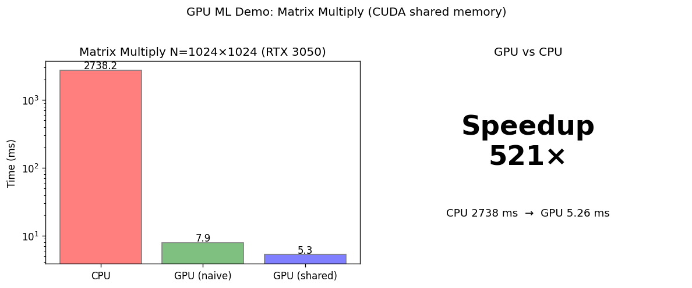
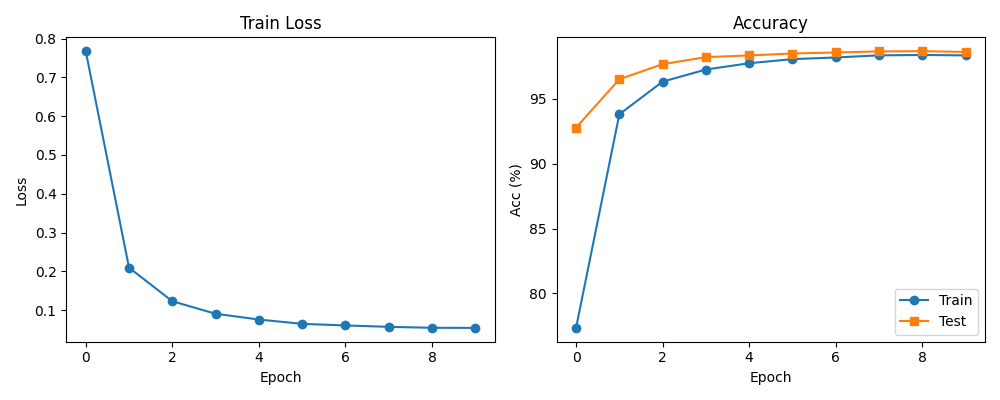
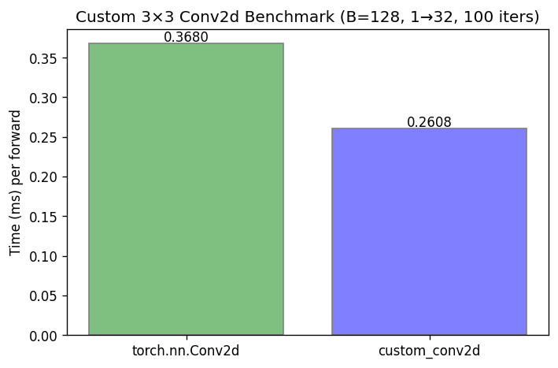

# RTX 3050 Laptop GPU Programming Benchmarks (Legacy)

大二資工生使用 **RTX 3050 6GB Laptop GPU (sm_86)** 實作 GPU programming benchmarks。

此為舊版 README，對照用。新版請見 [README.md](README.md)。

[](https://pytorch.org/)
[](https://developer.nvidia.com/cuda-toolkit)
[](LICENSE)

---

## 📑 Table of Contents

- [技術棧](#-技術棧)
- [主要成果](#-主要成果)
- [Benchmark 圖表](#-benchmark-圖表)
- [資料夾結構](#-資料夾結構)
- [安裝與重現](#-安裝與重現)
- [Citation & Star](#-citation--star)

---

## 🛠️ 技術棧

- **CUDA 12.4**
- **PyTorch 2.4 + cuDNN**
- **C++ / CUDA Extension**（PyTorch custom op）
- **Triton Kernel Language**（Python JIT kernel）

---

## 📊 主要成果

| Task | Implementation | Performance |
|------|----------------|--------------|
| Matrix Multiplication | Pure CUDA (shared memory tiled) | **521x** CPU speedup (N=1024, 5.3ms) |
| Reduction | Pure CUDA shared memory | **0.763ms** (1M elements) |
| MNIST CNN | PyTorch GPU (SmallCNN + AMP) | **99%** test accuracy |
| 3×3 Conv (1→32) FP16 | CUDA Extension | **1.50x** PyTorch (B=1024, 0.81ms) |
| 3×3 Conv FP16 | Triton Python kernel | **1.27x** PyTorch (B=128, 0.14ms) |

*Device: NVIDIA GeForce RTX 3050 6GB Laptop GPU (Ampere sm_86)*

---

## 📈 Benchmark 圖表

| 圖表 | 說明 |
|------|------|
| Matrix Mul 521x | CPU vs GPU 時間與 speedup (N=1024) |
| MNIST 99% | Train/test loss 與 accuracy 曲線 |
| Conv 1.5x | torch vs Extension vs Triton 耗時比較 |


*Matrix multiplication: 521x speedup vs CPU (N=1024)*


*MNIST SmallCNN: 99% test accuracy*


*3×3 Conv FP16: Extension 1.5x、Triton 1.27x vs PyTorch*

---

## 🗺️ CUDA Kernel Learning Roadmap

漸進式 **CUDA 學習路線圖**（naive vs optimized、vs CPU/PyTorch benchmark）：

- **Level 1**：Vector add、Parallel reduction、Naive matrix multiply  
- **Level 2**：Tiled matmul、Memory coalescing、Bank conflict  
- **Level 3**：Warp shuffle reduction、Fused ops、Persistent kernel  
- **Level 4**：FP16 Tensor Core matmul、WMMA example  

每項皆含 **naive / optimized 實作** 與 **效能比較**；說明見 `docs/level1_kernels.md`～`docs/level4_tensor_core.md`。

```bash
cd cuda_roadmap && ./build.sh    # 或 build.bat
python cuda_roadmap/run_benchmarks.py   # 從 repo 根目錄執行
```

完整說明：[docs/cuda_roadmap.md](docs/cuda_roadmap.md)

---

## 📁 資料夾結構

（略 — 見 README.md）

---

## 🔧 安裝與重現

（略 — 見 README.md）

---

## ⭐ Citation & Star

若此 repo 對你有幫助，歡迎 **Star** ⭐。

## License

[MIT](LICENSE)
