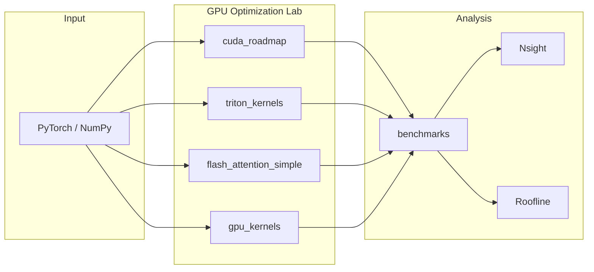
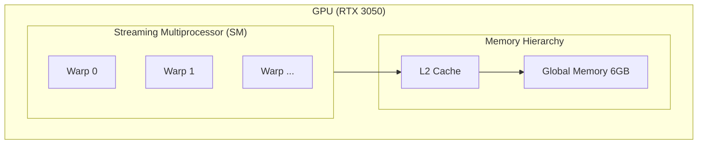
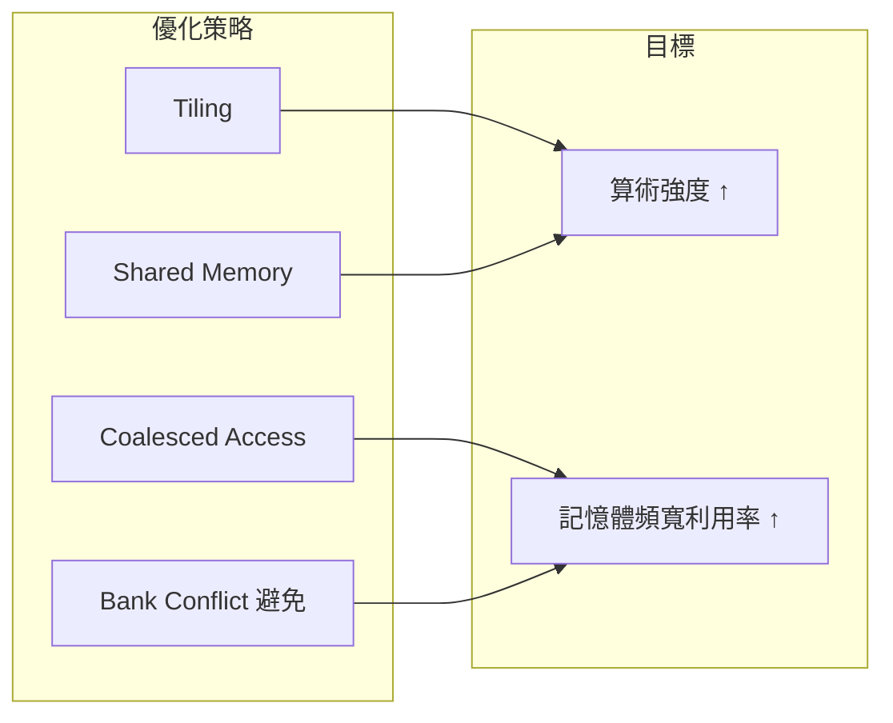
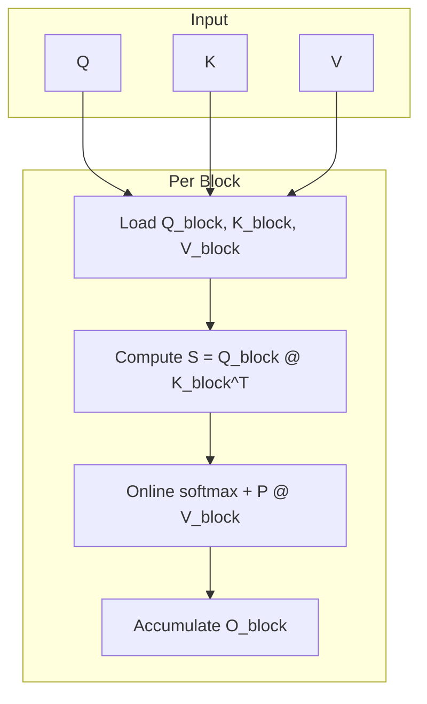
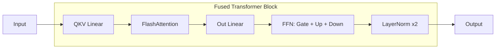
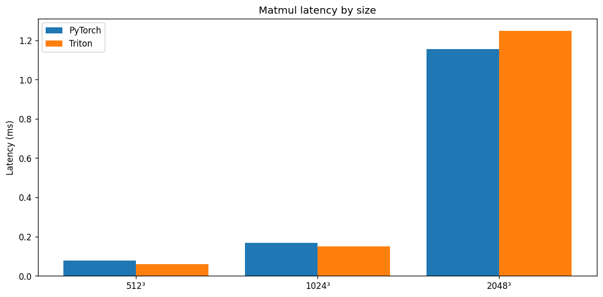
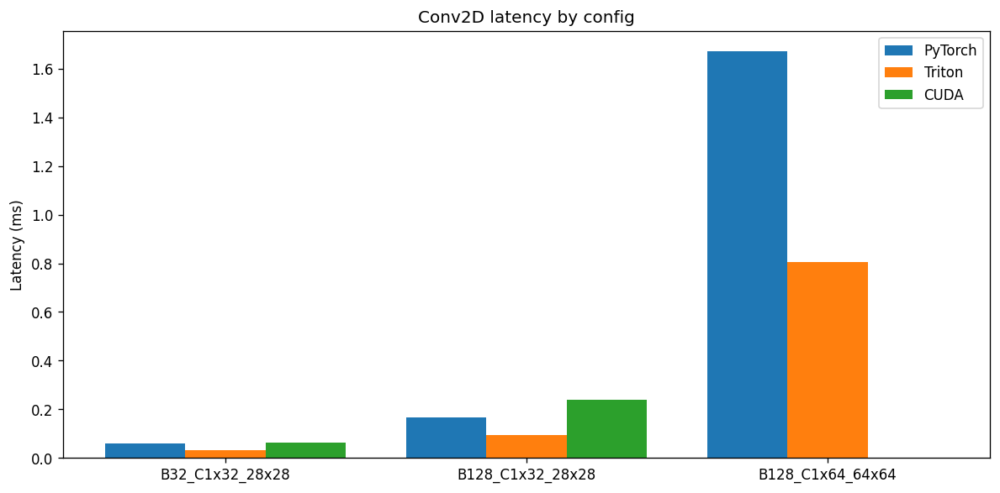
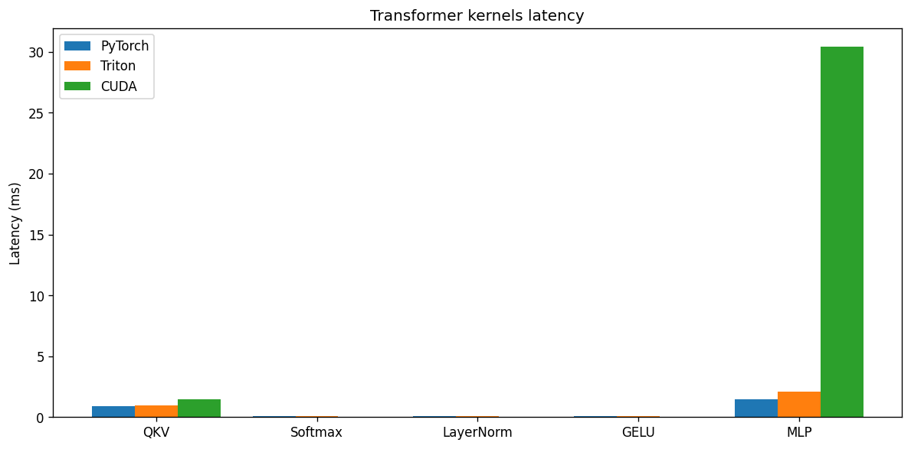
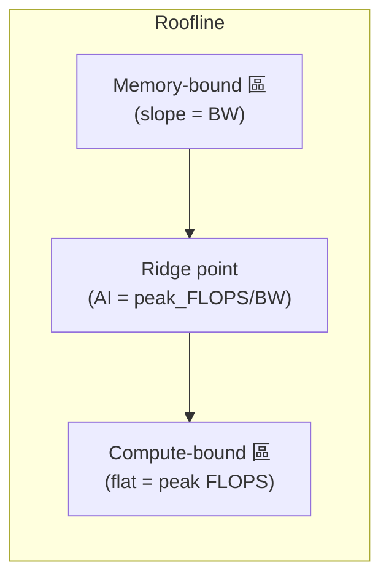

<p align="center">
  <a href="https://developer.nvidia.com/cuda-toolkit"></a>
  <a href="https://pytorch.org"></a>
  <a href="https://github.com/openai/triton"></a>
  
  
  <a href="LICENSE"></a>
</p>

<p align="center">
  <strong>⚡ RTX 3050 GPU Optimization Lab</strong> — Hands-on <strong>GPU engineering portfolio</strong>: CUDA · Triton · FlashAttention · Transformer kernels · Nsight · Roofline.
</p>

# ⚡ RTX 3050 GPU Optimization Lab

> 高效能 GPU 核心實驗室 — 以 **NVIDIA GeForce RTX 3050 Laptop (Ampere sm_86)** 為實測平台，從 CUDA 基礎到 Triton、FlashAttention、Transformer 核心的實作、優化與效能分析。適合作為 **GPU / 高效能計算** 作品集展示。

舊版結構與重點見 [README.legacy.md](README.legacy.md)。

---

## 📋 目錄

| # | 章節 |
|---|------|
| 1 | [專案概述](#1-專案概述) |
| 2 | [GPU 架構說明](#2-gpu-架構說明) |
| 3 | [CUDA 核心實驗](#3-cuda-核心實驗) |
| 4 | [Triton 核心實驗](#4-triton-核心實驗) |
| 5 | [FlashAttention 實作](#5-flashattention-實作) |
| 6 | [Transformer GPU 核心](#6-transformer-gpu-核心) |
| 7 | [效能基準測試](#7-效能基準測試) |
| 8 | [Nsight 效能剖析](#8-nsight-效能剖析) |
| 9 | [Roofline 分析](#9-roofline-分析) |
| — | [安裝與一鍵重現](#-安裝與一鍵重現-easy-to-reproduce) · [Example commands](#example-commands-running-kernels) |

**入門** → [docs/getting_started.md](docs/getting_started.md) · [文件索引](docs/INDEX.md) · [教學 Notebook](notebooks/README.md) · [**逐步教學 (tutorials/)**](tutorials/README.md) · [一鍵重現](scripts/README.md)

---

## 1. 專案概述

本實驗室專注於 **GPU 核心的撰寫、優化與剖析**，以 **RTX 3050 6GB** 為目標裝置，涵蓋從基礎 CUDA 到 Triton、FlashAttention 及 Transformer 相關核心，並透過 **Nsight** 與 **Roofline** 進行系統化效能分析。



| 模組 | 說明 |
|------|------|
| **cuda_roadmap** | 分級 CUDA 實驗：Vector add、Reduction、Naive/Tiled matmul、WMMA Tensor Core |
| **triton_kernels** | Triton：matmul、conv、layernorm、softmax、flash_attention |
| **flash_attention_simple** | FlashAttention：PyTorch 對照、CUDA、Triton |
| **gpu_kernels** | 純 CUDA：vector_add、reduction、matrix_mul、conv2d、transformer |
| **benchmarks / profiling** | 基準測試、Nsight 報告、Roofline 圖 |

---

## 2. GPU 架構說明

目標裝置：**NVIDIA GeForce RTX 3050 Laptop GPU** — Ampere (sm_86)，6GB GDDR6。

### SM 與記憶體階層



| 層級 | 範圍 | 延遲 (約) | 頻寬 | 在核心中的用途 |
|------|------|-----------|------|----------------|
| **Registers** | 每 thread | 0 cycle | 最高 | 區域變數、迴圈索引 |
| **Shared memory** | 每 block | ~20–30 cycle | 很高 | Tiling、reduction |
| **L1 / L2** | Per-SM / GPU | 變動 | 高 | 由 global 存取隱式使用 |
| **Global (VRAM)** | GPU | 200–400 cycle | 較低 | 大張量、I/O |

### RTX 3050 Laptop 規格

| 項目 | 數值 |
|------|------|
| 架構 | Ampere (sm_86) |
| FP32 峰值 | ~4.5 TFLOPS |
| FP16 Tensor Core | ~9 TFLOPS |
| 記憶體頻寬 | ~192 GB/s |
| VRAM | 6 GB GDDR6 |

### 優化策略對應



詳見：[docs/gpu_memory_hierarchy.md](docs/gpu_memory_hierarchy.md)、[docs/optimization_guide.md](docs/optimization_guide.md)。

---

## 3. CUDA 核心實驗

**cuda_roadmap** 提供分級 CUDA 實驗：從 naive 到優化版，並與 CPU / PyTorch 對照。

### 分級內容

| Level | 核心 | 重點 |
|-------|------|------|
| **Level 1** | Vector add、reduction、naive matmul | thread/block/grid、coalescing |
| **Level 2** | Tiled matmul、coalescing、bank conflict | Shared memory、tiling |
| **Level 3** | Warp shuffle、fused ops、persistent kernel | Warp 級、fusion |
| **Level 4** | FP16 Tensor Core matmul、WMMA | Tensor Cores、FP16 |

### GEMM 優化演進


### 代表效能 (RTX 3050)

| 核心 | Naive / 對照 | 優化版 | 備註 |
|------|--------------|--------|------|
| Vector add (2²⁰) | 1 elem/thread coalesced | **float4** 向量化 | 更少 transaction |
| Reduction (1M) | atomicAdd（慢） | **Shared memory** 樹狀 | **0.76 ms** |
| Matrix mul (1024²) | 僅 global | **Tiled** shared memory | **521×** vs CPU |
| FP16 matmul | FP32 CUDA cores | **WMMA** Tensor Core | Level 4 |

### 執行方式

```bash
cd cuda_roadmap && ./build.sh   # Windows: build.bat
python cuda_roadmap/run_benchmarks.py
```

文件：[docs/cuda_roadmap.md](docs/cuda_roadmap.md)、[docs/level1_kernels.md](docs/level1_kernels.md)～[level4_tensor_core.md](docs/level4_tensor_core.md)。

---

## 4. Triton 核心實驗

**triton_kernels** 提供高階 Triton JIT 核心：matmul、conv、layernorm、softmax、Flash Attention。

| 模組 | 說明 | 變體 |
|------|------|------|
| **matmul** | C = A @ B | Baseline、optimized、autotuned |
| **conv** | 3×3 Conv2D FP16 | Tile reuse、autotune |
| **layernorm** | Fused normalize + affine | Baseline、optimized、autotune |
| **softmax** | 最後一維 softmax | Max / sum / normalize |
| **flash_attention** | Fused softmax(QKᵀ/√d)V | Online softmax、causal |

### Triton vs CUDA 對照

| 面向 | CUDA | Triton |
|------|------|--------|
| 編程模型 | thread/block/grid、顯式索引 | Block 級、高階抽象 |
| 記憶體 | 手動 shared/global | `tl.load` / `tl.store`、block 描述 |
| 自動化 | 多需手動調校 | 部分自動並行與排程 |
| 可攜性 | 常需依架構微調 | 同一程式多架構 |

### 執行方式

```bash
python -m triton_kernels.run_benchmarks
```

安裝：`pip install triton`（Linux）或 `pip install triton-windows`（Windows）。  
詳見：[triton_kernels/README.md](triton_kernels/README.md)。

---

## 5. FlashAttention 實作

**flash_attention_simple** 實作記憶體高效注意力：不 materialize 完整 S×S 矩陣，以 **分塊 (tiling)** 與 **online softmax** 在 shared memory 內計算。

### 演算法概念



- **分塊**：Q、K、V 依 block 載入 shared memory，只算當前 block 對應的 S_ij。
- **Online softmax**：不需存整個 S，用 running max/sum 做數值穩定 softmax 並累加輸出。
- **結果**：O(N) 額外記憶體、較少 HBM 存取，適合長序列。

### 實作對照

| 實作 | 檔案 / 模組 | 記憶體 | 備註 |
|------|-------------|--------|------|
| **PyTorch 對照** | reference (correctness) | O(S²) | 僅正確性 |
| **CUDA** | `flash_attention_cuda.cu` | Tiled, shared mem | D ≤ 64 |
| **Triton** | `triton_kernels/flash_attention` | Tiled，無完整矩陣 | — |

### 建置與基準測試

```bash
cd flash_attention_simple && build.bat   # CUDA 獨立版（可選）
python flash_attention_simple/benchmark_flash_attention.py
```

比較 PyTorch、CUDA、Triton：B=2, H=8, D=64, S ∈ {128, 256, 512, 1024}。  
詳見：[flash_attention_simple/README.md](flash_attention_simple/README.md)。

---

## 6. Transformer GPU 核心

**gpu_kernels/transformer** 提供 FP16 Transformer 建構塊：PyTorch 對照、Triton、以及可選 CUDA。

### 融合區塊概念



| 核心 | 公式 / 功能 | 備註 |
|------|-------------|------|
| **Fused QKV** | y = x @ W_qkv + b | cuBLAS matmul + bias kernel |
| **Softmax** | 最後維度、row-wise | 3-pass: max, sum, normalize |
| **LayerNorm** | (x − μ) * rstd * γ + β | 在最後維度融合 |
| **GELU** | 0.5·x·(1 + tanh(…)) | FP16、float32 累加 |
| **Fused MLP** | linear2(GELU(linear1(x))) | 兩次 matmul + GELU |

### 執行方式

```bash
python benchmarks/transformer_benchmark.py
```

可設 `TRANSFORMER_BENCHMARK_FULL=1`（較大 B/S）、`TRANSFORMER_BENCHMARK_CUDA=1`（啟用自訂 CUDA）。  
詳見：[gpu_kernels/transformer/README.md](gpu_kernels/transformer/README.md)、[docs/transformer_benchmark_gpu_load.md](docs/transformer_benchmark_gpu_load.md)。

---

## 7. 效能基準測試

以下為 **RTX 3050 Laptop 6GB** 上之代表結果；實際數值依環境而異。

### 效能總覽 (Performance at a glance)

| Benchmark | Implementation | Latency (ms) | Throughput | Note |
|-----------|----------------|--------------|------------|------|
| **Matmul 1024³** | PyTorch (cuBLAS) | ~0.17 | ~12.8 TFLOPS | FP16 |
| **Matmul 1024³** | Triton | ~0.15 | ~14.3 TFLOPS | FP16 |
| **Conv 3×3 (B=128, 64×64)** | Triton | ~0.80 | ~705 GFLOPS | FP16 |
| **Attention (B=2, S=512, D=64)** | PyTorch SDPA | ~0.10 | ~10.2 TFLOPS | FP16 |
| **Transformer QKV (B=8, S=256)** | PyTorch | ~0.89 | ~8.1 TFLOPS | FP16 |
| **Reduction 1M** | CUDA shared mem | **0.76** | — | Level 1 |
| **Matrix mul 1024²** | CUDA tiled | — | **521×** vs CPU | Level 2 |

*Run `python tools/performance_dashboard.py` to generate full tables and charts on your machine.*

### Benchmark 圖表 (Benchmark charts)

圖表於執行基準腳本或 `tools/performance_dashboard.py` 後產出於 `benchmarks/plots/` 與 `benchmarks/`。範例：

| Chart | Path | Description |
|-------|------|-------------|
| Matmul latency by size | `benchmarks/plots/matmul_latency_by_size.png` | PyTorch vs Triton across 512³–2048³ |
| Conv comparison | `benchmarks/plots/conv_latency_by_config.png` | Conv2D across configs |
| Transformer kernels | `benchmarks/plots/transformer_latency_by_kernel.png` | QKV, Softmax, LayerNorm, GELU, MLP |
| Matrix mul speedup | `benchmarks/matrix_mul_speedup.png` | CPU vs GPU (e.g. 521×) |
| Roofline | `profiling/nsight_reports/roofline_model.png` | Memory- vs compute-bound |

*Images below appear after you run benchmarks (e.g. `python tools/performance_dashboard.py`).*


*Matmul: PyTorch vs Triton (512³–2048³)*


*Conv2D: latency by config*


*Transformer kernels: QKV, Softmax, LayerNorm, GELU, MLP*

### 基準腳本與圖表

| 腳本 | 輸出 / 圖 |
|------|-----------|
| `benchmarks/matmul_benchmark.py` | PyTorch vs Triton matmul；GFLOPS |
| `benchmarks/conv_benchmark.py` | torch vs Extension vs Triton → 如 `conv_benchmark.png` |
| `benchmarks/attention_benchmark.py` | SDPA vs Triton Flash |
| `benchmarks/transformer_benchmark.py` | QKV / Softmax / LayerNorm / GELU / MLP 延遲與頻寬 |
| `benchmarks/generate_charts.py` | 彙總產生多張圖表 |

### 圖表對照

| 圖表 | 腳本 / 路徑 | 說明 |
|------|-------------|------|
| **Matrix mul 521×** | `benchmarks/matmul_benchmark.py` → `matrix_mul_speedup.png` | CPU vs GPU 時間、加速比 (N=1024) |
| **MNIST 99%** | `extension/mnist_custom_conv.py` → `mnist_acc_loss.png` | 訓練/測試 loss 與準確率 |
| **Conv 比較** | `benchmarks/conv_benchmark.py` → `conv_benchmark.png` | torch vs Extension vs Triton |
| **Roofline** | `profiling/roofline_analysis/plot_roofline.py` → `roofline_model.png` | Memory-bound vs compute-bound |

```bash
python benchmarks/matmul_benchmark.py
python benchmarks/conv_benchmark.py
python benchmarks/attention_benchmark.py
python benchmarks/generate_charts.py   # 可加 --skip-mnist
```

---

## 8. Nsight 效能剖析

使用 **NVIDIA Nsight Compute** 與 **Nsight Systems** 取得 kernel 級與系統級數據。

### Nsight Compute — Kernel 指標範例

| 指標 | 意義 |
|------|------|
| **Occupancy** | 每 SM 的 thread 數 vs 理論上限 |
| **Memory bandwidth** | DRAM / L2 利用率 |
| **Warp divergence** | Warp 執行效率（低 ⇒ 發散多） |
| **Timeline** | Kernel 啟動順序與時長（Nsight Systems） |

### 產出檔案

| 檔案 | 工具 | 說明 |
|------|------|------|
| `transformer_timeline.nsys-rep` | Nsight Systems | Kernel 時間軸 |
| `transformer_kernels.ncu-rep` | Nsight Compute | 每 kernel 指標 |
| `transformer_kernels_metrics.json` | 解析腳本 | 供 Roofline 使用 |
| **roofline_model.png** | `plot_roofline.py` | Roofline：memory-bound vs compute-bound |

### Kernel 時間軸示意

```mermaid
gantt
    title Kernel 時間軸 (示意)
    dateFormat X
    axisFormat %L
    section GPU
    CUDA GEMM    :a1, 0, 120
    Softmax      :a2, 120, 145
    LayerNorm    :a3, 145, 162
    section CPU
    Launch / Sync :b1, 0, 5
    Launch       :b2, 118, 122
```



### 指令

```bash
# 剖析（SKIP_NSYS=1 跳過時間軸；NCU_QUICK=1 約 1 分鐘）
set SKIP_NSYS=1
set NCU_QUICK=1
python profiling/run_nsight_profiling.py

# Roofline 圖
python profiling/roofline_analysis/plot_roofline.py
```

輸出：`profiling/nsight_reports/roofline_model.png`。  
詳見：[profiling/nsight_reports/README.md](profiling/nsight_reports/README.md)、[docs/nsight_profiling_guide.md](docs/nsight_profiling_guide.md)。

---

## 9. Roofline 分析

以 **算術強度 (Arithmetic Intensity, AI)** 與 **峰值頻寬/算力** 繪製 Roofline，判斷 kernel 屬 **compute-bound** 或 **memory-bound**。

### Roofline 概念

- **算術強度** = FLOPs ÷ (bytes read + written)。
- **Ridge point** = peak_FLOPS ÷ peak_BW；**AI < Ridge** ⇒ memory-bound，**AI > Ridge** ⇒ compute-bound。



- **Ridge 以下** → memory-bound（如 Softmax、LayerNorm、GELU）。
- **Ridge 以上** → compute-bound（如 QKV、MLP）。

### RTX 3050 示意（Ridge ≈ 4.5e9 / 192e9 ≈ 23 FLOP/Byte）

```
GFLOPS
  ^
  |                    *-------- Peak Compute (~4.5 FP32)
  |                   /
  |                  /
  |                 *  GEMM / QKV
  |                /
  |               /
  |              *----------- Ridge (AI ≈ 23)
  |             /
  |            *  FlashAttn
  |           /
  |          *  Softmax / LayerNorm
  |         /
  +--------*---------------------------------> Arithmetic Intensity (log)
```

### 指令

```bash
python profiling/roofline_analysis/plot_roofline.py
```

詳見：[docs/optimization_guide.md](docs/optimization_guide.md)、Roofline 相關腳本與 `profiling/roofline/`。

---

## 🗂️ 專案結構

```
RTX3050-GPU-Mastery/
├── docs/                   # 文件（INDEX、getting_started、memory hierarchy、roadmap）
├── tutorials/              # 逐步教學：CUDA 基礎、shared memory、tiling、Triton、FlashAttention、Transformer
├── notebooks/              # 教學 Notebook（01–04、RTX 3050 範例）
├── scripts/                # 一鍵重現：reproduce_all.bat / .sh
├── benchmarks/             # matmul、conv、attention、transformer + generate_charts.py
├── profiling/              # Nsight 報告 + roofline_analysis
├── cuda_roadmap/           # CUDA 分級實驗（Level 1–4）
├── gpu_kernels/            # 純 CUDA：vector_add、reduction、matrix_mul、conv2d、transformer
├── triton_kernels/         # Triton：matmul、conv、layernorm、softmax、flash_attention
├── flash_attention_simple/ # FlashAttention：PyTorch、CUDA、Triton
├── extension/              # PyTorch CUDA Extension（conv）
├── requirements.txt
└── README.legacy.md        # 舊版對照
```

---

## 🚀 安裝與一鍵重現 (Easy to reproduce)

### Reproduce in 3 steps

```bash
# 1. Clone and install (from repo root)
git clone https://github.com/boson316/RTX3050-GPU-Mastery.git
cd RTX3050-GPU-Mastery
pip install -r requirements.txt
pip install torch torchvision --index-url https://download.pytorch.org/whl/cu124
pip install triton matplotlib ninja
# Windows: pip install triton-windows

# 2. Run all benchmarks and generate report (one command)
python tools/performance_dashboard.py --skip-mnist

# 3. (Optional) CUDA roadmap + extension
cd cuda_roadmap && ./build.sh   # or build.bat on Windows
cd extension && pip install --no-build-isolation .
```

*Full setup:* [docs/getting_started.md](docs/getting_started.md)

### Example commands: running kernels

All commands below are run from **repository root**. Copy-paste to try each component.

| What | Command |
|------|---------|
| **CUDA Level 1–4** | `cd cuda_roadmap && ./build.sh && python run_benchmarks.py` |
| **Triton (matmul, conv, softmax, etc.)** | `python -m triton_kernels.run_benchmarks` |
| **FlashAttention** | `python flash_attention_simple/benchmark_flash_attention.py` |
| **Transformer kernels** | `python benchmarks/benchmark_transformer.py` |
| **Matmul only** | `python benchmarks/benchmark_matmul.py` |
| **Conv only** | `python benchmarks/benchmark_conv.py` |
| **Attention only** | `python benchmarks/benchmark_attention.py` |
| **Full dashboard (all benchmarks + report)** | `python tools/performance_dashboard.py` |
| **One-click reproduce (benchmarks + charts)** | `scripts/reproduce_all.bat` (Windows) or `./scripts/reproduce_all.sh` (Linux/macOS) |
| **Roofline plot** | `python profiling/roofline_analysis/plot_roofline.py` |

### Install (detailed)

```bash
pip install -r requirements.txt
pip install torch torchvision --index-url https://download.pytorch.org/whl/cu124
pip install triton matplotlib ninja
# Windows Triton: pip install triton-windows

# CUDA roadmap (optional)
cd cuda_roadmap && ./build.sh   # Windows: build.bat

# PyTorch CUDA Extension / conv (optional)
cd extension && pip install --no-build-isolation .
```

**效能儀表板：** `python tools/performance_dashboard.py` → 產生 [benchmarks/performance_report.md](benchmarks/performance_report.md)。  
**Windows 建 Extension：** 請使用 **x64 Native Tools Command Prompt for VS**。

---

## ⭐ 引用與 Star

若本實驗室對你有幫助，歡迎 **Star** ⭐。

```text
RTX 3050 GPU Optimization Lab — CUDA roadmap, Triton kernels, Transformer, FlashAttention, Nsight profiling.
https://github.com/boson316/RTX3050-GPU-Mastery
```

## License

[MIT](LICENSE)

---

<p align="center">
  <strong>⚡ 從 CUDA 到 FlashAttention，在 RTX 3050 上系統化掌握 GPU 核心優化 ⚡</strong>
</p>
