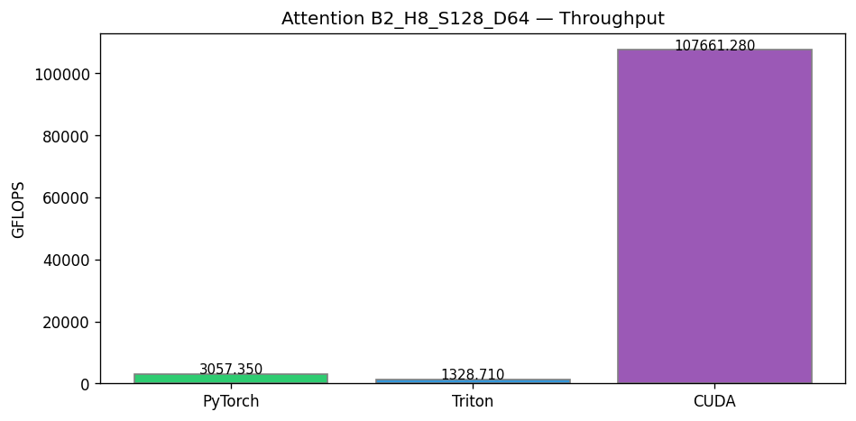
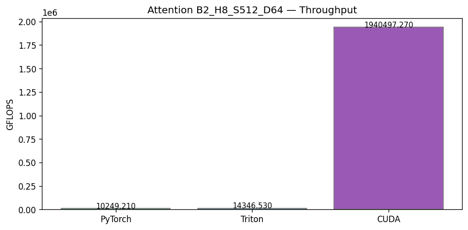
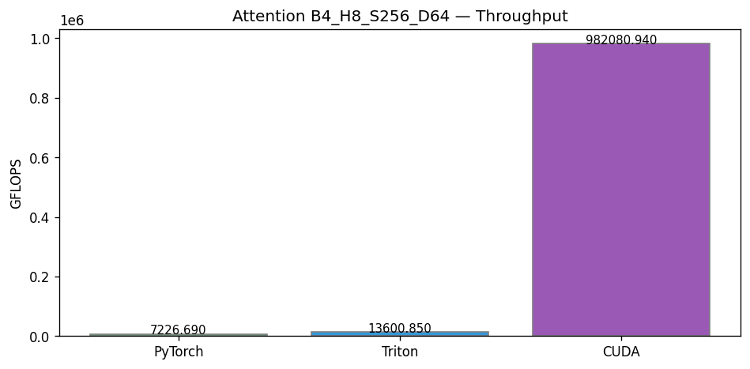
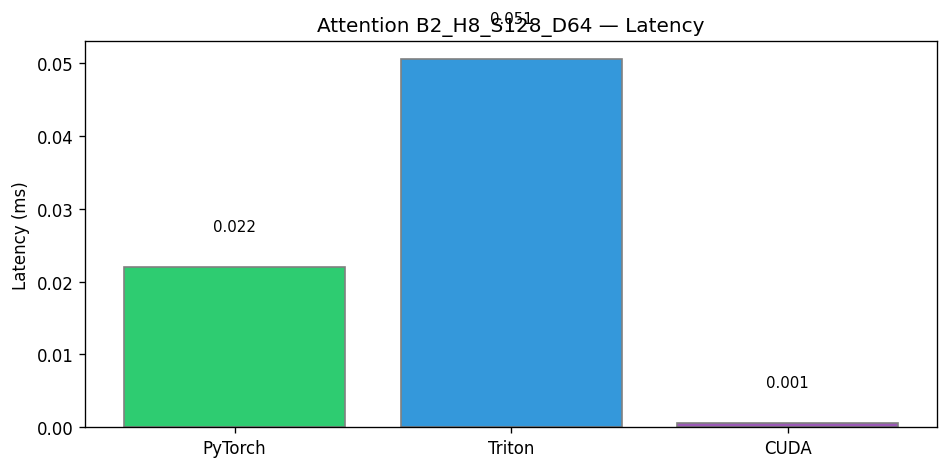
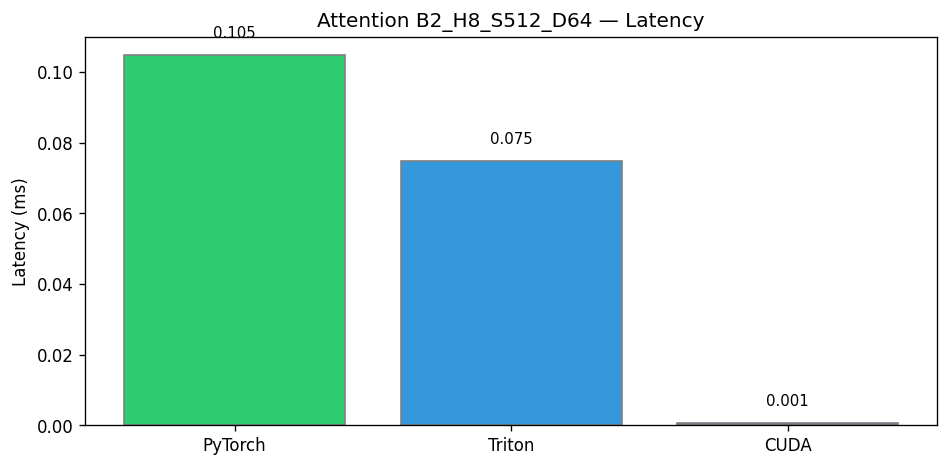
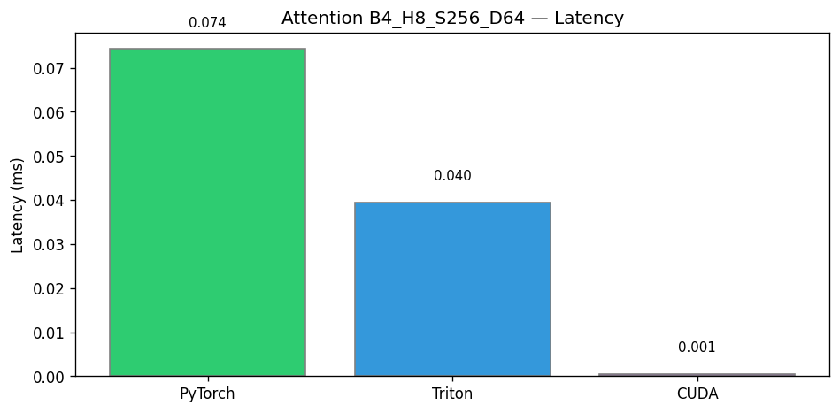

# Performance Report

**Generated:** 2026-03-15 19:42 UTC  
**Device:** NVIDIA GeForce RTX 3050 6GB Laptop GPU

---

## Summary

- Report built from existing CSV files (benchmarks were not run).
- Chart generation was skipped.

### Highlights

- **Attention (SDPA / Flash):** Best latency **0.0005 ms** (CUDA).
- **Conv2D (3×3, FP16):** Best latency **0.0331 ms** (Triton).
- **Matrix Multiply (FP16):** Best latency **0.0614 ms** (Triton).
- **Transformer Kernels (QKV, Softmax, LayerNorm, GELU, MLP):** Best latency **0.0568 ms** (LayerNorm (PyTorch)).

---

## Performance Tables

### Matrix Multiply (FP16)

| implementation | size | latency_ms | gflops | memory_bandwidth_gbs | gpu_utilization_pct |
| --- | --- | --- | --- | --- | --- |
| PyTorch | 512x512x512 | 0.0773 | 3473.81 | 20.35 |  |
| Triton | 512x512x512 | 0.0614 | 4373.2 | 25.62 |  |
| PyTorch | 1024x1024x1024 | 0.1676 | 12816.36 | 37.55 |  |
| Triton | 1024x1024x1024 | 0.1506 | 14261.22 | 41.78 |  |
| CUDA | 1024x1024x1024 | 0.5468 | 3927.25 | 11.51 |  |
| PyTorch | 2048x2048x2048 | 1.1545 | 14881.07 | 21.8 |  |
| Triton | 2048x2048x2048 | 1.2484 | 13761.88 | 20.16 |  |

### Conv2D (3×3, FP16)

| implementation | config | latency_ms | gflops | memory_bandwidth_gbs | gpu_utilization_pct |
| --- | --- | --- | --- | --- | --- |
| PyTorch | B32_C1x32_28x28 | 0.06 | 207.64 | 23.92 |  |
| Triton | B32_C1x32_28x28 | 0.0331 | 375.89 | 43.3 |  |
| CUDA | B32_C1x32_28x28 | 0.0635 | 196.17 | 45.19 |  |
| PyTorch | B128_C1x32_28x28 | 0.1675 | 297.54 | 34.26 |  |
| Triton | B128_C1x32_28x28 | 0.0938 | 531.11 | 61.16 |  |
| CUDA | B128_C1x32_28x28 | 0.2378 | 209.6 | 48.27 |  |
| PyTorch | B128_C1x64_64x64 | 1.6721 | 338.99 | 38.29 |  |
| Triton | B128_C1x64_64x64 | 0.804 | 705.0 | 79.64 |  |

### Attention (SDPA / Flash)

| implementation | config | latency_ms | gflops | memory_bandwidth_gbs | gpu_utilization_pct |
| --- | --- | --- | --- | --- | --- |
| PyTorch | B2_H8_S128_D64 | 0.022 | 3057.35 | 47.77 |  |
| Triton | B2_H8_S128_D64 | 0.0505 | 1328.71 | 20.76 |  |
| CUDA | B2_H8_S128_D64 | 0.0006 | 107661.28 | 3364.41 |  |
| PyTorch | B4_H8_S256_D64 | 0.0743 | 7226.69 | 56.46 |  |
| Triton | B4_H8_S256_D64 | 0.0395 | 13600.85 | 106.26 |  |
| CUDA | B4_H8_S256_D64 | 0.0005 | 982080.94 | 15345.01 |  |
| PyTorch | B2_H8_S512_D64 | 0.1048 | 10249.21 | 40.04 |  |
| Triton | B2_H8_S512_D64 | 0.0748 | 14346.53 | 56.04 |  |
| CUDA | B2_H8_S512_D64 | 0.0006 | 1940497.27 | 15160.13 |  |

### Transformer Kernels (QKV, Softmax, LayerNorm, GELU, MLP)

| kernel | implementation | latency_ms | gflops | memory_bandwidth_gbs |
| --- | --- | --- | --- | --- |
| QKV | PyTorch | 0.8912 | 8132.22 | 18.09 |
| QKV | Triton | 0.9932 | 7297.13 | 16.24 |
| QKV | CUDA | 1.4422 | 5025.49 | 11.18 |
| Softmax | PyTorch | 0.062 |  | 101.5 |
| Softmax | Triton | 0.0597 |  | 105.44 |
| LayerNorm | PyTorch | 0.0568 |  | 110.77 |
| LayerNorm | Triton | 0.057 |  | 110.4 |
| GELU | PyTorch | 0.0578 |  | 108.85 |
| GELU | Triton | 0.0643 |  | 97.91 |
| MLP | PyTorch | 1.4396 | 13425.32 | 19.67 |
| MLP | Triton | 2.1117 | 9152.57 | 13.41 |
| MLP | CUDA | 30.4389 | 634.96 | 0.93 |

---

## Benchmark Charts

Charts are saved in `benchmarks/plots/` and `benchmarks/*.png`.

- `plots/attention_gflops_B2_H8_S128_D64.png`
- `plots/attention_gflops_B2_H8_S512_D64.png`
- `plots/attention_gflops_B4_H8_S256_D64.png`
- `plots/attention_latency_B2_H8_S128_D64.png`
- `plots/attention_latency_B2_H8_S512_D64.png`
- `plots/attention_latency_B4_H8_S256_D64.png`
- `plots/attention_latency_by_config.png`
- `plots/conv_gflops_B128_C1x32_28x28.png`
- `plots/conv_gflops_B128_C1x64_64x64.png`
- `plots/conv_gflops_B32_C1x32_28x28.png`
- `plots/conv_latency_B128_C1x32_28x28.png`
- `plots/conv_latency_B128_C1x64_64x64.png`
- `plots/conv_latency_B32_C1x32_28x28.png`
- `plots/conv_latency_by_config.png`
- `plots/matmul_gflops_1024_1024_1024.png`
- `plots/matmul_gflops_2048_2048_2048.png`
- `plots/matmul_gflops_512_512_512.png`
- `plots/matmul_latency_1024_1024_1024.png`
- `plots/matmul_latency_2048_2048_2048.png`
- `plots/matmul_latency_512_512_512.png`
- `plots/matmul_latency_by_size.png`
- `plots/transformer_gelu_latency.png`
- `plots/transformer_latency_by_kernel.png`
- `plots/transformer_layernorm_latency.png`
- `plots/transformer_mlp_gflops.png`
- `plots/transformer_mlp_latency.png`
- `plots/transformer_qkv_gflops.png`
- `plots/transformer_qkv_latency.png`
- `plots/transformer_softmax_latency.png`
- `matrix_mul_speedup.png`
- `conv_benchmark.png`
- `mnist_acc_loss.png`

Example embedding (paths relative to this report in `benchmarks/`):

*... and 26 more in `benchmarks/plots/`*

---

*Report generated by `tools/performance_dashboard.py`*
