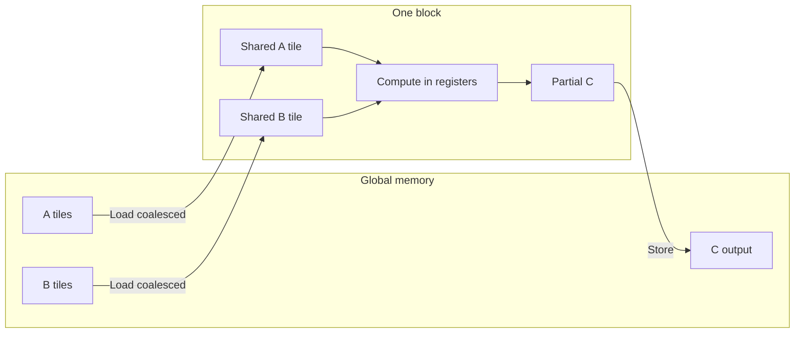
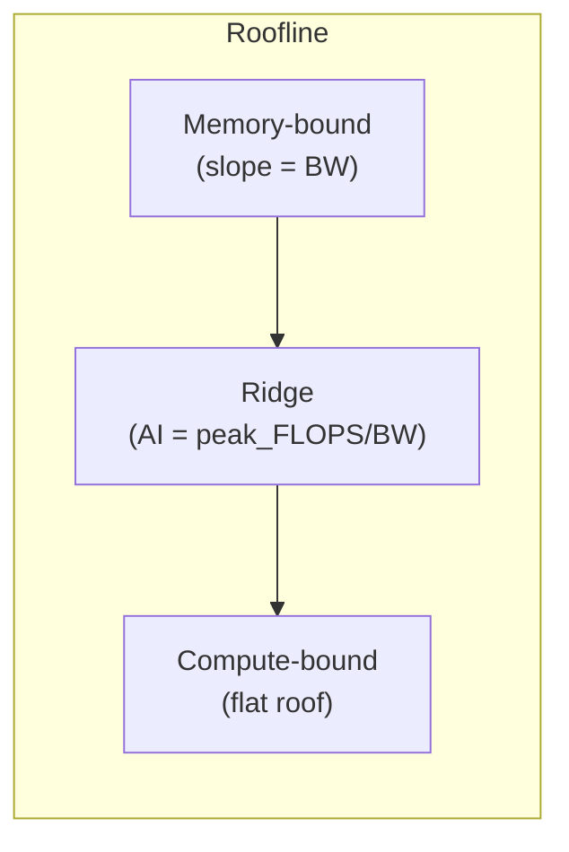

# GPU Memory Hierarchy — Diagrams

Visual reference for the GPU memory hierarchy and data flow. See [gpu_memory_hierarchy.md](gpu_memory_hierarchy.md) for the full text.

**Generated diagram:** [images/gpu_memory_hierarchy.png](images/gpu_memory_hierarchy.png) (from `python docs/scripts/generate_diagrams.py`)

---

## 1. Hierarchy: fast → slow

```
┌─────────────────────────────────────────────────────────────────┐
│  Registers (per thread)         — 0 cycles, highest BW           │
├─────────────────────────────────────────────────────────────────┤
│  Shared memory (per block)      — ~20–30 cycles, very high BW    │
├─────────────────────────────────────────────────────────────────┤
│  L1 / L2 cache (per SM / GPU)   — variable, high BW               │
├─────────────────────────────────────────────────────────────────┤
│  Global memory / VRAM (GPU)     — 200–400 cycles, lower BW       │
└─────────────────────────────────────────────────────────────────┘
```

---

## 2. Mermaid: Host and GPU

```mermaid
flowchart TB
  subgraph Host["Host (CPU)"]
    CPU[CPU]
    RAM[System RAM]
    CPU <--> RAM
  end

  subgraph GPU["GPU (e.g. RTX 3050)"]
    direction TB
    subgraph SM["Streaming Multiprocessors"]
      Reg[Registers\nper thread]
      ShMem[Shared memory\nper block]
      Reg --> ShMem
    end
    L1[L1 / L2 cache]
    Global[Global memory\n(VRAM 6GB)]
    SM --> L1 --> Global
  end

  RAM <-->|PCIe| Global
```

---

## 3. Mermaid: Data flow in a tiled matmul

Typical pattern: load tiles from **global** into **shared**, compute in registers, write result to **global**.



---

## 4. Mermaid: Roofline — memory-bound vs compute-bound

- **Left of ridge:** performance limited by **memory bandwidth** (slope = BW).
- **Right of ridge:** performance limited by **peak FLOPS** (flat roof).
- **Ridge point** = peak_FLOPS / peak_BW (e.g. ~47 FLOP/byte for RTX 3050 FP16).



---

## 5. Table: Where to use each level

| Level | Typical use in kernels |
|-------|-------------------------|
| **Registers** | Loop indices, accumulators, per-thread temporaries |
| **Shared** | Tiles for matmul/conv, block-level reductions, cooperation |
| **L1/L2** | Cached when accessing global in coalesced patterns |
| **Global** | Input/output tensors; minimize round-trips via tiling |

---

## 6. Coalescing (conceptual)

**Good:** adjacent threads read adjacent addresses → one transaction per warp.

```
Thread 0 → addr 0    Thread 1 → addr 4    Thread 2 → addr 8   ...
```

**Bad:** strided or scattered access → many transactions per warp.

---

For optimization steps and Nsight profiling, see [optimization_guide.md](optimization_guide.md).
